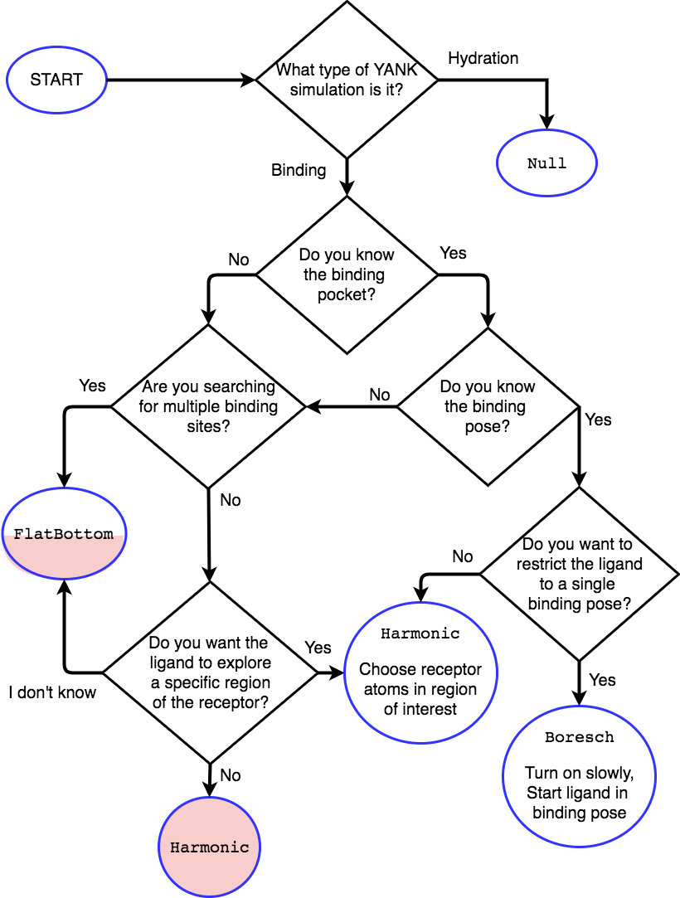

.. _algorithms:

.. py:currentmodule:: yank

**********
Algorithms
**********

We describe the various components of modern alchemical free energy calculations with YANK.

Solvent treatment
=================

YANK provides the capability for performing alchemical free energy calculations in both explicit solvent (where a water
model such as TIP3P :cite:`Jorgensen1983` or TIP4P-Ew :cite:`Horn2004` is used to fill the simulation box with solvent)
and implicit solvent (where a continuum representation of the solvent is used to reduce calculation times at the cost of
some accuracy).
While explicit solvent free energy calculations are still considered the "gold standard" in terms of accuracy, implicit
solvent free energy calculations may offer a very rapid way to compute approximate binding free energies while still
incorporating some of the entropic and enthalpic contributions to binding.

Implicit solvent
----------------

YANK provides the somewhat unique ability to perform alchemical free energy calculations in implicit solvent.

Solvent Models
^^^^^^^^^^^^^^

For the :ref:`implicit solvent models in YANK <yaml_solvents_implicit_solvent>` any of the AMBER implicit solvent models
available in OpenMM are available for use in the `implicit_solvent` directive:

.. tabularcolumns:: |l|L|

=============  ==================================================================================================================================
Value          Meaning
=============  ==================================================================================================================================
{Not Set}      No implicit solvent is used when the option is not set.
:code:`HCT`    Hawkins-Cramer-Truhlar GBSA model\ :cite:`Hawkins1995` (corresponds to igb=1 in AMBER)
:code:`OBC1`   Onufriev-Bashford-Case GBSA model\ :cite:`Onufriev2004` using the GB\ :sup:`OBC`\ I parameters (corresponds to igb=2 in AMBER).
:code:`OBC2`   Onufriev-Bashford-Case GBSA model\ :cite:`Onufriev2004` using the GB\ :sup:`OBC`\ II parameters (corresponds to igb=5 in AMBER).
:code:`GBn`    GBn solvation model\ :cite:`Mongan2007` (corresponds to igb=7 in AMBER).
:code:`GBn2`   GBn2 solvation model\ :cite:`Nguyen2013` (corresponds to igb=8 in AMBER).
=============  ==================================================================================================================================

Generalized GBSA Model
^^^^^^^^^^^^^^^^^^^^^^

In order to permit alchemical free energy calculations to be carried out in implicit solvent, the contribution of atoms
in the alchemically annihilated region must also be annihilated.
This is done by introducing a dependence on the alchemical parameter :math:`\lambda` into the GBSA potential terms.
Each particle *i* has an associated indicator function :math:`\eta_i` which assumes the value of 1 if the particle is
part of the alchemical region and 0 otherwise.

The modified Generalized Born contribution to the potential energy is given by :cite:`Onufriev2004`

.. math::
   U_{GB}(x; \lambda, \eta) = - \frac{V_e}{2} \left(\frac{1}{\epsilon_{\text{solute}}}-\frac{1}{\epsilon_{\text{solvent}}}\right)\sum _{i,j}\frac{ s_{ij}(\lambda,\eta) \, {q}_{i} {q}_{j}}{{f}_{\text{GB}}\left(||x_i - x_j||_2,{R}_{i},{R}_{j};\lambda, \eta\right)}

where the indices *i* and *j* run over all particles, :math:`\epsilon_\text{solute}` and :math:`\epsilon_\text{solvent}`
are the dielectric constants of the solute and solvent respectively, :math:`q_i` is the charge of particle *i*\ ,
and :math:`||x_i - x_j||_2` is the distance between particles *i* and *j* which we will short-hand to :math:`d_{ij}`
The electrostatic constant :math:`V_e` is equal to 138.935485 nm kJ/mol/e\ :sup:`2`\ .

The alchemical attenuation function :math:`s_{ij}(\lambda, \eta)` attenuates interactions involving softcore atoms, and is given by

.. math::
   s_i(\lambda,\eta) &= \lambda \eta_i + (1-\eta_i) \\
   s_{ij}(\lambda,\eta) &= s_i(\lambda,\eta) \cdot s_j(\lambda,\eta)

The alchemically-modified GB effective interaction distance function :math:`f_\text{GB}(d_{ij}, R_i, R_j; \lambda, \eta)`, which has units of distance, is defined as

.. math::
   {f}_{\text{GB}}\left({d}_{ij},{R}_{i},{R}_{j};\lambda\right)={\left[{d}_{ij}^2+{R}_{i}{R}_{j}\text{exp}\left(\frac{-{d}_{ij}^2}{{4R}_{i}{R}_{j}}\right)\right]}^{1/2}

:math:`R_i` is the Born radius of particle *i*\ , which calculated as

.. math::
   R_i=\frac{1}{\rho_i^{-1}-r_i^{-1}\text{tanh}\left(\alpha \Psi_{i}-{\beta \Psi}_i^2+{\gamma \Psi}_i^3\right)}

where :math:`\alpha`, :math:`\beta`, and :math:`\gamma` are the tunable parameters for the solvent model. Exact values
are discussed in later sections. :math:`\rho_i` is the adjusted atomic radius of particle *i*\ , which
is calculated from the atomic radius :math:`r_i` as :math:`\rho_i = r_i-o_f` where :math:`o_f = 0.009` nm is the
offset parameter.
:math:`\Psi_i` is calculated as an integral over the van der Waals
spheres of all particles outside particle *i*\ :

.. math::
   \Psi_i=\frac{\rho_i}{4\pi}\int_{\text{VDW}}\theta\left(|\mathbf{r}|-{\rho }_{i}\right)\frac{1}{{|\mathbf{r}|}^{4}}{d}^{3}\mathbf{r}

where :math:`\theta`\ (\ *r*\ ) is a step function that excludes the interior of particle *i* from the integral.
This integral can be re-written as sum over all other *j* particles in the system as

.. math::

   \Psi_i = \frac{\rho_i}{2}\sum_{j} H(U_p-\rho_i) {s}_{j}(\lambda,\eta) \Big[ & \frac{1}{L} - \frac{1}{U_p} \\
                                                                                               & + \frac{1}{4}\left({d}_{ij}-\frac{{S}_{j}^2}{{d}_{i,j}}\right)\left(\frac{1}{U_p^2} - \frac{1}{L^2}\right) \\
                                                                                               & + \frac{1}{2{d}_{ij}}\text{ln}\left(\frac{L}{U_p}\right) + C \Big]

with

.. math::

   U_p &= {d}_{ij} + {S}_j \\
   L   &= \text{max}\left(\rho_i, |{d}_{ij} - S_j|\right) \\
   C   &= 2H\left(S_j - {d}_{ij} - \rho_i\right)\left(\frac{1}{\rho_i} - \frac{1}{L}\right)

where :math:`U_p` and :math:`L` are the smoothed upper and lower bounds of :math:`\Psi`, :math:`S_j` is the
scalar factor on particle *j* from the HTC model which is a function of atom-type :cite:`Hawkins1995`,
and :math:`H(x)` is the Heaviside step function following :math:`H(0)=1`.

The self-interaction energy of the particle is computed as

.. math::

  {U}_{\text{GB,self},i} = -\frac{V_e}{2}s_i(\lambda,\eta)\left(\frac{1}{\epsilon_{\text{solute}}}-\frac{1}{\epsilon_{\text{solvent}}}\right) \frac{q_i^2}{R_i}

The alchemically-modified surface area potential term is a modified form of the term given by :cite:`Schaefer1998`\ :cite:`Ponder`

.. math::
   U_{SA}(x;\lambda) = \epsilon_{SA} \cdot 4\pi
   \sum_{i} s_i(\lambda,\eta) {\left({r}_{i}+{r}_{\text{solvent}}\right)}^{2}{\left(\frac{{r}_{i}}{{R}_{i}}\right)}^{6}

where :math:`\epsilon_{SA}` is the surface area energy penalty and :math:`r_\text{solvent}` is the solvent radius,
which is taken to be 0.14 nm.
The default value for the surface area penalty :math:`\epsilon_{SA}` is 2.25936 kJ/mol/nm\ :sup:`2`\ .

HCT Solvent Models
^^^^^^^^^^^^^^^^^^

The ``HCT`` model is actually a precursor to the generalized GBSA model as shown above. Instead of rewritting the
full equations, we can derive this model from the previous equations by changing the :math:`R_i` equation to

.. math::

   R_i = \rho_i - \frac{\Psi_i}{\rho_i}

OBCX Solvent Models
^^^^^^^^^^^^^^^^^^^

.. note::
    ``OBC2`` is the recommended model for implicit solvent in YANK

The ``OBC1`` and ``OBC2`` models follow the theory from the Generalized GBSA model and use the following parameters
for :math:`\alpha`, :math:`\beta`, and :math:`\gamma`:

* ``OBC1``: GB\ :sup:`OBC`\ I  parameters :math:`\alpha` = 0.8, :math:`\beta` = 0, :math:`\gamma` = 2.91.
* ``OBC2``: GB\ :sup:`OBC`\ II parameters :math:`\alpha` = 1, :math:`\beta` = 0.8, :math:`\gamma` = 4.85.

GBn Solvent Models
^^^^^^^^^^^^^^^^^^

The ``GBn`` models are extensions to the generalized model above to correct for short range interactions when
:math:`{d}_{ij} < R_i + R_2 + 2R_W` where :math:`R_W` is the radius of the solvent particle we are representing as
a continuum. These models can be computed through a small correction on the generalized model's :math:`\Psi_i` parameter
of

.. math::

   \Psi_{i,\text{GBn}} = \Psi_{i} + \rho_i \sum_j \frac{{S}_{\text{neck}} m_0 s_j(\lambda, \eta)}{1 + ({d}_{ij} - d_0)^2 + 0.3({d}_{ij} - d_0)^6}

where :math:`m_0` and :math:`d_0` are parameters to maximize the term and have continuous derivatives, found numerically
and tabulated internally. The :math:`S_{\text{neck}}` parameter is tunable.

The ``GBn`` model refits :math:`\alpha`, :math:`\beta`, :math:`\gamma` and all of the :math:`S_x` terms for the following:

* :math:`\alpha` = 1.095, :math:`\beta` = 1.908, :math:`\gamma` = 2.508.
* :math:`S_{\text{neck}} = 0.362`, :math:`S_H =1.091`, :math:`S_C = 0.484`, :math:`S_N = 0.700`, :math:`S_O = 1.068`

The ``GBn2`` model refits :math:`\alpha`, :math:`\beta`, :math:`\gamma` per atomic scaling factor :math:`S_x`, and then
also refits the :math:`S_{\text{neck}}` and :math:`o_f` parameters for a total of 18 parameters. We do not show the
table here for space, please see Table 2 in Nguyen et al for the entries :cite:`Nguyen2013`.

Explicit solvent
----------------

Solvent model
^^^^^^^^^^^^^

Any explicit solvent model that can be constructed via AmberTools is supported for building through the
:mod:`pipeline module <yank.pipeline>`.

.. tabularcolumns:: |l|L|

===================  ============================================
Model                Water Model
===================  ============================================
:code:`tip3p`        TIP3P water model :cite:`Jorgensen1983` (older model used in many legacy calculations)
:code:`tip4pew`      TIP4P-Ew water model :cite:`Horn2004` (recommended, default)
:code:`tip3pfb`      TIP3P-FB water model :cite:`Wang2014`
:code:`tip4pfb`      TIP4P-FB water model :cite:`Wang2014`
:code:`tip5p`        TIP5P water model :cite:`Mahoney2000`
:code:`spce`         SPC/E water model :cite:`Berendsen1987`
:code:`swm4ndp`      SWM4-NDP water model :cite:`Lamoureux2006`
===================  ============================================

.. .. todo:: What should we recommend for reaction field calculations?  Is there a ForceBalance-parameterized version for use with reaction field?

Electrostatics treatment
^^^^^^^^^^^^^^^^^^^^^^^^

OpenMM supports several electrostatics models for the periodic simulation boxes used with explicit solvent calculations, all of which are accessible in YANK:

* ``PME`` - **Particle mesh Ewald (PME)** :cite:`Essmann1995,Toukmaji1996` is the "gold standard" for accurate long-range treatment of electrostatics in periodic solvated systems.

* ``CutoffPeriodic`` - **Reaction field electrostatics** :cite:`Tironi1995` is a faster, less accurate methods for treating electrostatics in solvated systems that assumes a uniform dielectric outside the nonbonded cutoff distance.
    .. warning:: |EwaldWarn|

.. |EwaldWarn| replace::
    YANK currently has some difficulty with alchemical transformations involving Reaction Field because of the inability
    to represent the long range contribution of the alchemically modified ligand over all alchemical states, so phase
    space overlap with the endpoints can be poorer than with other methods.

* ``Ewald`` - **Ewald electrostatics**, which is approximated by the much faster ``PME`` method.  It is not recommended that users employ this method for alchemical free energy calculations due to the speed of this method and availability of ``PME``.

Long-range dispersion corrections
^^^^^^^^^^^^^^^^^^^^^^^^^^^^^^^^^

Analytical isotropic long-range dispersion correction
"""""""""""""""""""""""""""""""""""""""""""""""""""""

Simulations in explicit solvent will by default add an **analytical isotropic long-range dispersion correction** to
correct for the truncation of the nonbonded potential at the cutoff.
Without this correction, significant artifacts in solvent density and other physical properties can occur :cite:`Shirts2007`.

.. _ansiotropic_algorithm:

Anisotropic long-range dispersion correction
""""""""""""""""""""""""""""""""""""""""""""

Because this correction assumes that the solvent is isotropic outside of the nonbonded cutoff, however, significant
errors in computed binding free energies are possible (up to several kcal/mol for absolute binding free energies of large
ligands) if the diameter of the protein is larger than the nonbonded cutoff due to the significant difference in density
between protein and solvent :cite:`Shirts2007`.

To correct for this, we utilize the **anisotropic long-range dispersion correction** described in Ref. :cite:`Shirts2007`
in which the endpoints of each alchemical leg of the free energy calculation are perturbed to a system where the cutoffs
are enlarged to a point where this error is negligible.
Because this contribution is only accumulated when configurations are written to disk, the additional computational
overhead is small.
The largest allowable cutoff (slightly smaller than one-half the smallest box edge) is automatically selected for this
purpose, if the user does not specify one. Settings for this can be found in the
:ref:`YAML options <yaml_options_anisotropic_dispersion_cutoff>`, or through the API at
:func:`yank.AlchemicalPhase.create`

Restraints and standard state correction
========================================

Restraints between receptor and ligand are used for two purposes:

* **Defining the bound species**: The theoretical framework for alchemical free energy calculations requires that the bound receptor-ligand complex be defined in some way.
  While this can be done by an indicator function that assumes the value of unity of the receptor and ligand are bound otherwise, it is difficult to restrict the bound complex integral to this region within the context of a molecular dynamics simulation.
  Instead, a fuzzy indicator function that can assume continuous values is equivalent to imposing a restraint that restricts the ligand to be near the receptor to define the bound complex and restrict the configuration integral.

* **Reducing accessible ligand conformations during intermediate alchemical states**: Another function of restraints is to restrict the region of conformation space that must be integrated in the majority of the alchemical states, speeding convergence.
  For example, orientational restraints greatly restrict the number of orientations or binding modes the ligand must visit during intermediate alchemical states, greatly accelerating convergence.
  On the other hand, if multiple orientations are relevant but cannot be sampled during the imposition of additional restraints, this can cause the resulting free energy estimate to be heavily biased.

In principle, both types of restraints would be used in tandem: One restraint would define the bound complex, while another restraint would be turned to reduce the amount of sampling required to evaluate alchemical free energy differences.
In the current version of YANK, only one restraint can be used at a time.
More guidance is given for each restraint type below.

.. _standard_state_algorithm:

Standard state correction
-------------------------

Since the restraint defines the bound complex, in order to report a standard state binding free energy, we must compute
the free energy of releasing the restraint into a volume ``V0`` representing the *standard state volume* to achieve a
standard state concentration of 1 Molar. ``V0`` is computed as the following:

.. math::

   V_0 = \frac{1 \text{L}}{N_A}

where ``N_A`` is in Avogadro's constant. This calculation results in :math:`V0 = 1660.53928 \unicode{xC5}^3` where we treat ``V0``
as a per mole quantity. More detail of how this free energy fits into the thermodynamic cycle can be found in
`theory <theory.html>`_.

.. The \unicode{xC5} creates the angstrom symbol (A with circle above), \AA and \r{A} are mangled by sphinx and don't render

Restraint types
---------------

``YANK`` currently supports several kinds of receptor-ligand restraints.

No restraints (``null``)
^^^^^^^^^^^^^^^^^^^^^^^^

While it is possible to run a simulation without a restraint in explicit solvent---such that the noninteracting ligand
must explore the entire simulation box---this is not possible in implicit solvent since the ligand can drift away into
infinite space.
Note that this is not recommended for explicit solvent, since there is a significant entropy bottleneck that must be
overcome for the ligand to discover the binding site from the search space of the entire box.

Spherically symmetric restraints
^^^^^^^^^^^^^^^^^^^^^^^^^^^^^^^^

Harmonic restraints (``Harmonic``)
""""""""""""""""""""""""""""""""""

A harmonic potential is imposed between the closest atom to the center of the receptor and the closest atom to the center of the ligand, given the initial geometry.
The equilibrium distance is zero, while the spring constant is selected such the potential reaches ``kT`` at one radius of gyration.
This allows the ligand to explore multiple binding sites---including internal sites---without drifting away from the receptor.
For implicit and explicit solvent calculations, harmonic restraints should be imposed at full strength and retained
throughout all alchemical states to define the bound complex.
Since the harmonic restraint is significant at the periphery of the receptor, it can lead to bias in estimates of
binding affinities on the surface of receptors.

The standard-state correction is computed via numerical quadrature.

Flat-bottom restraints (``FlatBottom``)
"""""""""""""""""""""""""""""""""""""""

A variant of ``Harmonic`` where the restraint potential is zero in the central region and grows as a half-harmonic potential outside of this region.
A length scale ``sigma`` is computed from the median absolute distance from the central receptor atom to all atoms, multiplied by 1.4826.
The transition from flat to harmonic occurs at ``r0 = 2*sigma + 5*angstroms``.
A spring constant of ``K = 0.6 * kilocalories_per_mole / angstroms**2`` is used.
This restraint is described in detail in :cite:`Shirts2013:yank`.
For implicit and explicit solvent calculations, flat-bottom restraints should be imposed at full strength and retained
throughout all alchemical states to define the bound complex.

The standard-state correction is computed via numerical quadrature.

Orientational restraints
^^^^^^^^^^^^^^^^^^^^^^^^

Orientational restraints are used to confine the ligand to a single binding pose.

.. warning:: Because the ligand is highly restrained orientationally, the initial configuration should have the ligand well-placed in the binding site; errors in initial pose cannot be easily recovered from.

.. _algorithm_boresch:

Boresch restraints (``Boresch``)
""""""""""""""""""""""""""""""""

A common type of **orientational restraints** between receptor and ligand :cite:`Boresch2003`.
These restrain a distance, two angles, and three torsions in an attempt to keep the ligand in a specific relative binding pose.
Default spring constants used in Table 1 of the original paper :cite:`Boresch2003` are used, and a set of atoms is
automatically chosen (three each in the ligand and receptor) to ensure that the distance (:math:`r_{aA0}`) is within [1,4]
Angstroms and the angles (:math:`\theta_{A0}`, :math:`\theta_{B0}`) are several standard deviations away from 0 and
:math:`\pi`.

Standard use of Boresch restraints is to turn on the restraints over several alchemical states and keep the restraints
active while discharging followed by Lennard-Jones decoupling.
This assumes the ligand is already effectively confined to its bound state even when the restraint is off such that
imposing the restraint measures the free energy of additionally confining the *bound* ligand; if this is not the case,
it could lead to problematic free energy estimates.

The standard state correction is computed by evaluating using a combination of numerical and analytical
one-dimensional integrals from Eq. 12 of :cite:`Boresch2003`.
Note that the analytical standard state correction described in Eq. 32 of :cite:`Boresch2003` is inaccurate
(up to several ``kT``) in certain regimes (near :math:`r_{aA0}` and :math:`\theta_{A0}`, :math:`\theta_{B0}` near
0 or :math:`\pi`) and should be avoided.

.. warning:: Symmetry corrections for symmetric ligands are **not** automatically applied; see Ref :cite:`Boresch2003` and :cite:`Mobley2006:orientational-restraints` for more information on correcting for ligand symmetry.

Restraint Selection Flowchart
-----------------------------

Consult the following flowchart to assist in selecting the restraints and reference the following key additional
guidance

* Restraints are marked in end point circles
* Unless stated, the restraints should always be fully coupled (NO ``lambda_restraints`` in the YAML file)
* Assume default parameters for restraints unless otherwise stated
* Shaded entries are not recommended for use and may require user insight to be accurate, even if they are the "best option" for the choice of answers.

    * The ``Harmonic`` at the bottom restraints the ligand to the centroid of the receptor only, which may not be the binding site. Consider if this is really what you want to do.
    * The half-shaded ``FlatBottom`` entry is not recommended if you don't know what the ligand should do. You probably want the ligand to explore the whole receptor, but we cannot be sure if you reached this entry from the shaded side

* A ``Null`` entry indicates no restraints needed at all

Adding new restraints
---------------------

``YANK`` also makes it easy to add new types of restraints by subclassing the ``yank.restraints.ReceptorLigandRestraint`` class.
Simply subclassing this class (an abstract base class) and implementing the following methods will allow this restraint type to be specified via its classname.

* ``__init__(self, topology, state, system, positions, receptor_atoms, ligand_atoms):``

* ``get_restraint_force(self):``

* ``get_standard_state_correction(self):``

.. _algorithm_alchemical_protocol:

Alchemical protocol
===================

Alchemical intermediate states are chosen to provide overlap along a one dimensional thermodynamic path for each phase
of the simulation, ultimately making a :ref:`complete thermodynamic cycle of binding/solvation <yank_cycle>`.

A number of rules of thumb are followed when choosing what order to carry out alchemical intermediates,
examples of which can be found in the
:doc:`Examples Documentation <examples/index>`.

#. Couple restraints before any other alchemical changes
#. Decouple electrostatics first and separate from all other alchemical changes=
#. Decouple Lennard-Jones interactions last.
#. Always define the "fully coupled" state as the first index, 0 in Python, in the list of alchemical states (the state most closely representing the physically bound/fully solvated conditions)
#. Always define the "fully decoupled/annihilated" state as the last index, -1 in Python, in the list of states.

.. _algorithm_auto_protocol:

Automatic Alchemical Protocol Selection
---------------------------------------

YANK supports :ref:`automatically choosing the alchemical path <yaml_protocols_auto>` instead of setting all the values
by hand. The states are chosen such that the standard deviation of the difference of energies between states is roughly equal within
some tolerance. States spaced equally by this metric should have better phase space overlap than states placed
haphazardly, and should have better mixing in replica exchange.

The algorithm is as follows, given an upper and lower bound for a set of alchemical parameters:

#. A short simulation is run at the upper bound of the parameter set.
#. The potential energies of the simulated state are computed at a proposed state where the alchemical parameters are perturbed.
#. The energies of the simulation are reweighted in the proposed state
#. The standard deviation of the difference in energies between the simulated and proposed state is computed.
#. If the standard deviation is within some tolerance around a target value, the proposed state is chosen and the process repeats with the proposed state as the new, simulated state.
#. If the standard deviation is outside the tolerance, a new state is proposed is repeated without updating the simulated state.
#. The cycle continues until the parameters' lower bounds are reached.

Sampling from multiple alchemical (or other thermodynamic) states
=================================================================

YANK provides several schemes for sampling from multiple thermodynamic states within a single calculation:

* ``MultistateSampler``: Independent simulations at distinct thermodynamic states
* ``ReplicaExchangeSampler``: Replica exchange among thermodynamic states (also called Hamiltonian exchange if only the Hamiltonian is changing)
* ``SAMSSampler``: Self-adjusted mixture sampling (also known as optimally-adjusted mixture sampling)

While the thermodynamic states sampled usually differ only in the alchemical parameters, other thermodynamic parameters (such as temperature) can be modulated as well at intermediate alchemical states.
This may be useful in, for example, experimenting with ways to reduce correlation times.

In all of these schemes, one or more **replicas** is simulated.
Each iteration includes the following phases:
* Allow replicas to switch thermodynamic states (optional)
* Allow replicas to sample a new configuration using Markov chain Monte Carlo (MCMC)
* Each replica computes the potential energy of the current configuration in multiple thermodynamic states
* Data is written to disk

Below, we describe some of the aspects of these samplers, followed by the MCMC approaches that can be used to sample new configurations.

``MultiStateSampler``: Independent simulations at multiple thermodynamic states
-------------------------------------------------------------------------------

The ``MultiStateSampler`` allows independent simulations from multiple thermodynamic states to be sampled.
In this case, the MCMC scheme is used to propagate each replica by sampling from a fixed thermodynamic state.

.. math::

   s_{k,n+1} = s_{k, n} \\
   x_{k,n+1} \sim p(x | s_{k, n+1})

An inclusive "neighborhood" of thermodynamic states around this specified state can be used to define which thermodynamic states the reduced potential should be computed for after each iteration.
If all thermodynamic states are included in this neighborhood (the default), the MBAR scheme [CITE] can be used to optimally estimate free energies and uncertainties.
If a restricted neighborhood is used (in order to reduce the amount of time spent in the energy evaluation stage), a variant of the L-WHAM (local weighted histogram analysis method) [CITE] is used to extract an estimate from all available information.

``ReplicaExchangeSampler``: Replica exchange among thermodynamic states
-----------------------------------------------------------------------

The ``ReplicaExchangeSampler`` implements a Hamiltonian replica exchange scheme with Gibbs sampling :cite:`Chodera2011` to sample multiple thermodynamic states in a manner that improves mixing of the overall Markov chain.
By allowing replicas to execute a random walk in thermodynamic state space, correlation times may be reduced when sampling certain thermodynamic states (such as those with alchemically-softened potentials or elevated temperatures).

In the basic version of this scheme, a proposed swap of configurations between two alchemical states, *i* and *j*, made by comparing the energy of each configuration in each replica and swapping with a basic Metropolis criteria of

.. math::
    P_{\text{accept}}(i, x_i, j, x_j) &= \text{min}\begin{cases}
                               1, \frac{ e^{-\left[u_i(x_j) + u_j(x_i)\right]}}{e^{-\left[u_i(x_i) + u_j(x_j)\right]}}
                               \end{cases} \\
        &= \text{min}\begin{cases}
          1, \exp\left[\Delta u_{ji}(x_i) + \Delta u_{ij}(x_j)\right]
          \end{cases}

where :math:`x` is the configuration of the subscripted states :math:`i` or :math:`j`, and :math:`u` is the reduced potential energy.
While this scheme is typically carried out on neighboring states only, we also implement a much more efficient form of Gibbs sampling in which many swaps are attempted to generate an approximately uncorrelated sample of the state permutation over all :math:`K` :cite:`Chodera2011`.
This speeds up mixing and reduces the total number of samples needed to produce uncorrelated samples.

``SAMSSampler``: Self-adjusted mixture sampling
-----------------------------------------------

The ``SAMSSampler`` implements self-adjusted mixture sampling (SAMS; also known as optimally adjusted mixture sampling) :cite:`Tan2017:SAMS`.
This combines one or more replicas that sample from an expanded ensemble with an asymptotically optimal Wang-Landau-like weight update scheme.

.. math::

   s_{k,n+1} = p(s | x_{k,n}) \\
   x_{k,n+1} \sim p(x | s_{k, n+1})

SAMS state update schemes
^^^^^^^^^^^^^^^^^^^^^^^^^

Several state update schemes are available:

* ``global-jump`` (default): The sampler can jump to any thermodynamic state (RECOMMENDED)
* ``restricted-range-jump``: The sampler can jump to any thermodynamic state within the specified local neighborhood (EXPERIMENTAL; DISABLED)
* ``local-jump``: Only proposals within the specified neighborhood are considered, but rejection rates may be high (EXPERIMENTAL; DISABLED)

SAMS Locality
^^^^^^^^^^^^^

The local neighborhood is specified by the ``locality`` parameter.
If this is a positive integer, the neighborhood will be defined by state indices ``[k - locality, k + locality]``.
Reducing locality will restrict the range of states for which reduced potentials are evaluated, which can speed up the energy evaluation stage of each iteration at the cost of restricting the amount of information available for free energy estimation.
By default, the ``locality`` is global, such that energies at all thermodynamic states are computed; this allows the use of MBAR in data analysis.

SAMS weight adaptation algorithm
^^^^^^^^^^^^^^^^^^^^^^^^^^^^^^^^

SAMS provides two ways of accumulating log weights each iteration:

* ``optimal`` accumulates weight only in the currently visited state ``s``
* ``rao-blackwellized`` accumulates fractional weight in all states within the energy evaluation neighborhood

SAMS initial weight adaptation stage
^^^^^^^^^^^^^^^^^^^^^^^^^^^^^^^^^^^^

Because the asymptotically-optimal weight adaptation scheme works best only when the log weights are close to optimal, a heuristic initial stage is used to more rapidly adapt the log weights before the asymptotically optimal scheme is used.
The behavior of this first stage can be controlled by setting two parameters:

* ``gamma0`` controls the initial rate of weight adaptation. By default, this is 1.0, but can be set larger (e.g., 10.0) if the free energy differences between states are much larger.
* ``flatness_threshold`` controls the number of (fractional) visits to each thermodynamic state that must be accumulated before the asymptotically optimal weight adaptation scheme is used.

Markov chain Monte Carlo
========================

To generate samples from individual thermodynamic states, YANK uses compositions of Markov chain Monte Carlo (MCMC) moves from the
`openmmtools.mcmc module <http://openmmtools.readthedocs.io/en/latest/mcmc.html>`_.
Each MCMC move is treated as a single, independent, MCMC move carried out in sequence so that samples are drawn from the equilibrium distribution at each step.
Should one move be rejected, the other moves will still be carried out.

Generalized Hybrid Monte Carlo
------------------------------

Generalized hybrid Monte Carlo (GHMC) moves are MC moves where the proposed move is generated by some molecular dynamics
algorithm, and then weighted by generalized ensemble being sampled. In YANK, we generate samples with a psuedo-GHMC
move through Langevin dynamics, but do not actually make an MC evaluation. Velocities are drawn from the Maxwell-Boltzmann
distribution at the start of the move, then MD is propagated through the stochastic Langevin dynamics integration.
We assume the discretization error is negligible, but the generation of the correct distribution is only
truly exact in the limit of infinitely small timestep.

See the `OpenMMTools documentation on Langevin Dynamics Moves <http://openmmtools.readthedocs.io/en/latest/api/generated/openmmtools.mcmc.LangevinDynamicsMove.html#openmmtools.mcmc.LangevinDynamicsMove>`_
for more information.

Metropolis Monte Carlo displacement and rotation moves
------------------------------------------------------

Ligands often are trapped by kinetic barriers and steric clashes, limiting their configurational space. Hamiltonian
replica exchange allows the ligand to escape these traps by swapping to a new the thermodynamic state, but the swap
may occur with a state where the ligand is nowhere near the same volume of space.

YANK enhances sampling by proposing MC displacement and rotation moves on the ligand without leaving the same state.
These MC moves are separate actions, and evaluated as independent moves.

The MC Rotation move is proposed by rotating
all particles in the ligand by a uniform normalized quaternion 4-vector :cite:`Shoemake1992`. See the
`OpenMMTools MCRotation docs <http://openmmtools.readthedocs.io/en/latest/api/generated/openmmtools.mcmc.MCRotationMove.html#openmmtools.mcmc.MCRotationMove>`_
for more information.

The MC Displacement proposes a move where the ligand atoms are translated in each Cartesian dimension by uniformly
drawn random number on :math:`[0,1]` domain, then scaled by a small perturbation distance, :math:`\sigma`. The final
proposed position is then evaluated as the MC move. The ligand in this case is translated as a singular unit, so each
particle is translated by the same distance in each direction.

Ligand rotation and displacements moves are disabled for the
:ref:`orientational Boresch restraints <algorithm_boresch>`. This class of MCMC move under the orientational restraints
will almost always be rejected so they are not enabled to reduce computational time.

Automated equilibration detection
=================================

In principle, we don't need to discard initial "unequilibrated" data; the estimate over a very long trajectory will
converge to the correct free energy estimate no matter what, we simply need to run long enough. Some MCMC practitioners,
like Geyer, feel strongly enough about this to `throw up a webpage <http://users.stat.umn.edu/~geyer/mcmc/burn.html>`_
in defense of this position.

In practice, if the initial conditions are very atypical of equilibrium (which is often the case in molecular
simulation, especially after energy minimization), it helps a great deal to discard an initial part of the simulation to
equilibration. But how much? How do we decide? YANK chooses an automatic equilibrium detection scheme based on the
following articles: :cite:`Shirts2008` :cite:`Chodera2011` :cite:`Chodera2016`

.. _repex_timeseries:

Determining a timeseries to analyze in a replica-exchange simulation
--------------------------------------------------------------------

For a standard molecular dynamics simulation producing a trajectory :math:`x_t`, it's reasonably straightforward to
decide approximately how much to discard if human intervention is allowed. Simply look at some property
:math:`A_t = A(x_t)` over the course of the simulation. This property should ideally be one that we know has some slow
behavior that may affect the quantities we are interested in computing and find the point where :math:`A_t` seems to
have "settled in" to typical equilibrium behavior. :math:`A(x)` is a good choice if we're
interested in the expectation :math:`\left\langle A \right\rangle`.

If we're interested in a free energy, which is computed from the potential energy differences,
let's suppose the potential energy :math:`U(x)` may be a good quantity to examine.

In replica-exchange simulation, there are K replicas that execute nonphysical walks on many potential energy
functions :math:`U_k(x)`. The multiple states call into question what observable should be examined.
Let's work by analogy. In a single simulation, we would plot some quantity related to the potential energy :math:`U(x)`,
or its reduced version :math:`u(x) = \beta U(x)`. This is actually the negative logarithm of the probability
density :math:`\pi(x)` sampled, up to an additive constant:

.. math::

    u(x) = -\ln \pi(x) + c

For a replica-exchange simulation, the sampler state is given by the pair :math:`(X,S)`, where
:math:`X = \{x_1, x_2, \ldots, x_K \}` are the replica configurations and :math:`S = \{s_1, s_2, \ldots, s_K\}` is the
vector of state index permutations associated with the replicas. The total probability sampled is

.. math::

    \Pi(X,S) &= \prod_{k=1}^K \pi_{s_k}(x_k) \\
             &= (Z_1 \cdots Z_K) \exp\left[-\sum_{k=1}^K u_{s_k}(x_k)\right] \\
             &= Q^{-1} e^{-u_*(X)}

where the pseudoenergy :math:`u_*(X)` for the replica-exchange simulation is defined as

.. math::

    u_*(X) \equiv \sum_{k=1}^K u_{s_k}(x_k)

That is, :math:`u_*(X)` is the sum of the reduced potential energies of each replica configuration at the current
thermodynamic state it is visiting.

.. _autocorrelate_algorithm:

Identifying equilibration and production regions in a replica-exchange simulations
----------------------------------------------------------------------------------

YANK automatically determines an optimal partitioning between the initial equilibration phase of the simulation
(which is discarded) and the production phase of the simulation (which is analyzed to estimate free energies).

We first define a some terminology. We start with
finite count of samples :math:`t \in [1,T]` where `t` is the individual sample index and `T` is the total number of
samples. For a given observable :math:`A` drawn from a configuration :math:`x`, indexed by :math:`t`,
let :math:`a_t \equiv A(x_t)`.

In an infinite set of samples from the simulations, we expect the bias from the initial transiant, not fully-equilibrated,
samples to be negligible. However, in a finite simulation, this is not necessarily the case. We construct an
estimator for the expectation of the observable

.. math::

    \hat{A}_{[1,T]} = \frac{1}{T} \sum_{t-1}^T a_t

where we also assume that there is some correlation time between each observable :math:`\tau`. We can also define a
metric of statistical efficiency by :math:`g \equiv 1 + 2\tau`. If we compute the
correlation time with the non-equilibrated data, then the correlation times will be much longer than they should be,
resulting in many more samples being discarded due to correlation. As such, we assume that we can reduce
the bias in the series of observables by discarding some initial set of samples, :math:`t_0 \geq t` such that the
expectation then becomes

.. math::

    \hat{A}_{[t_0,T]} = \frac{1}{T - t_0 + 1} \sum_{t=t_0}^T a_t

Because we can conclude the bias will only increase the correlation time, lowering the total number of samples used
in analysis, we define the metric of both equilibration and correlation as the :math:`t_0` which maximizes the total
number of effective samples leftover after discarding from equilibration and correlation. This metric is computed by

.. math::

    N_{\text{eff}}(t_0) \equiv (T − t_0 + 1)/g_{t_0}

where :math:`g_{t_0}` is the statistical efficiency of the timeseries with all samples before :math:`t_0` discarded
as the equilibration. We then look at each index of :math:`t` proposing it as :math:`t_0` until we find the one which
maximizes :math:`N_{\text{eff}}`. :math:`\tau` is computed from the following equations :cite:`Chodera2016`:

.. math::

    \tau &\equiv \sum_{t=t'}^{T-1} \left(1-\frac{1}{T}\right)C_t \\
     C_t &\equiv \frac{\left\langle a_n a_{n+t} \right\rangle - \left\langle a_n \right\rangle^2}
                      {\left\langle a_{n}^{2} \right\rangle - \left\langle a_n \right\rangle^2}

where :math:`t'` is the proposed :math:`t_0`, :math:`a_n` is the observable series on indices :math:`[t',T]`, and
:math:`a_{n+t}` is the observable series on indices :math:`[t'+t,T]`. At the maximized :math:`N_{\text{eff}}`, all
samples before :math:`t_0` are considered "unequilibrated" and discarded, and decorrelated samples are drawn on an
interval of :math:`g_{t_0}` from the remaining series.

This is all implemented in the ``pymbar`` module: `timeseries <https://github.com/choderalab/pymbar/blob/master/pymbar/timeseries.py>`_

.. _mbar_algorithm:

Analysis with MBAR
==================

Free energies and other observables are computed with the Multistate Bennet Acceptance Ratio (MBAR) implemented in
the ``pymbar`` package :cite:`Shirts2008`. MBAR requires the energy of each sampled configuration evaluated at every
state we wish to compute the free energy at, and then the number of samples drawn from each state. From there, the
free energy of each state is estimates through the self-consistent equation of

.. math::

    \hat{f}_i = -\ln \sum_{j=1}^K \sum_{n=1}^{N_j}
                \frac{\exp \left[ -u_i (x_{j,n})\right]}
                {\sum_{k=1}^K N_k \exp \left[\hat{f}_k -u_k(x_{j,n}) \right]}

where :math:`f` is the dimensionless free energy estimate of state i (in units of kT), :math:`K` is the number of
sampled states, :math:`u` is the dimensionless potential energy, :math:`N` is the number of samples from a given state,
and :math:`x` is the sampled configuration. Because this requires a self-consistent, it is an underspecified problem as
presented. However, we really only care about differences in free energies between states, so one state is chosen as
the reference, so :math:`f_0 = 0`. This equation is also not conditioned on state :math:`i` being part of the sampled
states :math:`K`, allowing estimation of the free energy at any thermodynamic state such as the unsampled states with
expanded cutoffs that YANK supports.

Automated convergence detection
===============================

YANK has the ability to run a simulation until the free energy difference in a phase reaches a user-specified target
uncertainty.
If this option is set, either through the :ref:`yaml options <yaml_samplers_online_analysis_parameters>` or
:meth:`the Sampling API <yank.multistate.MultiStateSampler`, then each phase will be simulated until either the
error free energy difference reaches the target, or the maximum number of iterations has been reached.

Free energy error alone is a helpful, but not necessarily sufficient metric of convergence, and
`other measures <http://nbviewer.ipython.org/github/choderalab/simulation-health-reports/blob/master/examples/yank/YANK%20analysis%20example.ipynb>`_
will be implemented in future releases to help better gauge simulation convergence.

.. _sim_hp_report:

Simulation health report
========================

YANK's analysis module can also create Jupyter Notebooks which help provide visual information to determine the
quality of the simulation. An example notebook can be
`found here <https://github.com/choderalab/yank/blob/master/Yank/reports/YANK_Health_Report_Example.ipynb>`_.
This notebook takes the analysis ideas from the previous section and puts them into chart format. All of the information
shown in this report is also part of the main analysis suite run from command line, but can often get lost as pure text
output.

The first block of the notebook plots the timeseries, autocorrelation time, and effective number of samples detailed in
the previous sections for each phase. The first block also breaks down how many samples are lost to equilibration and
decorrelation, and how many samples are left over for analysis.

The second block computes the mixing statistics between each replica. This is done empirically based on number of times
a replica transitions from alchemical state :math:`i` to state :math:`j` in a single iteration. Because the overall chain
must obey detailed balance, we count each transition as contributing 0.5 counts toward the :math:`i \rightarrow j`
direction and 0.5 in the reverse. This has the advantage of ensuring that the eigenvalues of the resulting transition
matrix among alchemical states are purely real.

The second block also computes the Perron (subdominant/second) eigenvalue as a measure of how well mixed all the
replicas are. If the subdominant eigenvalue would have been unity, then the chain would be decomposable, meaning that it
completely separated into two separate sets of alchemical states that did not mix.
This would have been an indication of poor phase space overlap between some alchemical states.
If the configuration :math:`x` sampling is infinitely fast so that :math:`x` can be considered to be at equilibrium
given the instantaneous permutation :math:`S` of alchemical state assignments,
the subdominant eigenvalue :math:`\lambda_2 \in [0,1]` gives an estimate of the mixing time of the overall
:math:`(X,S)` chain:

.. math::

    \tau_{\lambda} = \frac{1}{1-\lambda_2}

:math:`\tau_{\lambda}` is then the estimate for how many iterations must elapse before the collection of replicas
fully mix once. The closer this value is to unity (1), the better.
